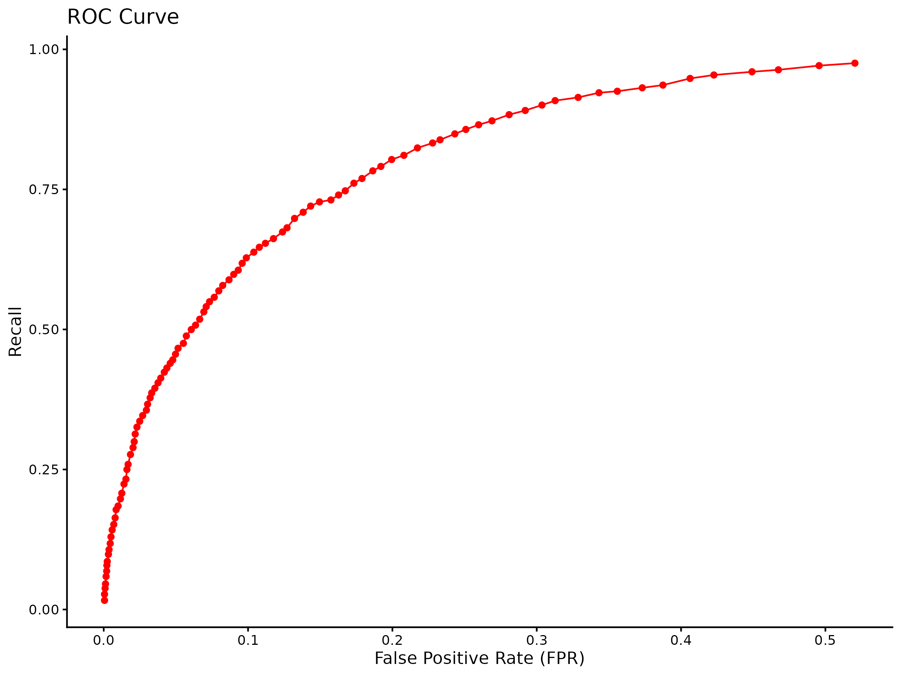
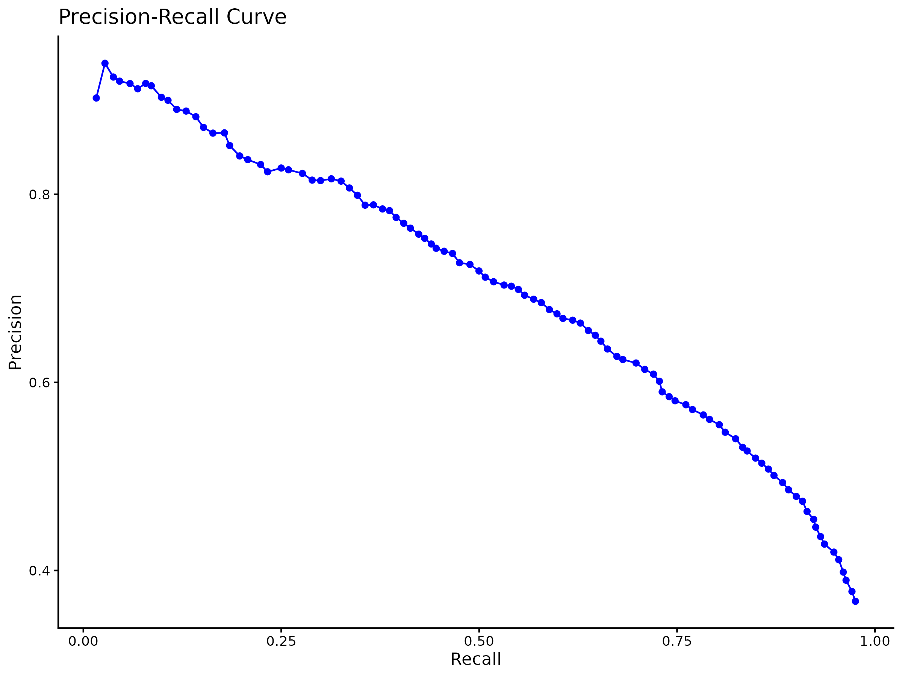

# m6APrediction

## Package Purpose

`m6APrediction` is an R package designed to predict m6A sites based on RNA features using trained machine learning models. This tool helps researchers analyze and predict m6A methylation sites in RNA sequences using various input features.

## Installation

To install the `m6APrediction` package from GitHub, you can use either `devtools` or `remotes`. Here are the commands:

```r
# Using devtools
devtools::install_github("Bis0214/m6APrediction")

# Or using remotes
remotes::install_github("Bis0214/m6APrediction")
```
## Usage Example

Here’s a minimal example demonstrating how to use the two prediction functions in the package:

### Predicting Multiple m6A Sites

```r
# Load the package
library(m6APrediction)

# Load the trained model
model <- readRDS(system.file("extdata", "rf_fit.rds", package = "m6APrediction"))

# Load example input data
input_data <- read.csv(system.file("extdata", "m6A_input_example.csv", package = "m6APrediction"))

# Predict multiple m6A sites
predictions <- prediction_multiple(
  ml_fit = model,
  feature_df = input_data
)

print(predictions)
```
### Predicting a Single m6A Site

```r
# Load the package
library(m6APrediction)

# Load the trained model
model <- readRDS(system.file("extdata", "rf_fit.rds", package = "m6APrediction"))

# Prepare input features
gc_content <- input_data$gc_content[1]  # Example value
RNA_type <- input_data$RNA_type[1]      # Example value
RNA_region <- input_data$RNA_region[1]  # Example value
exon_length <- input_data$exon_length[1]  # Example value
distance_to_junction <- input_data$distance_to_junction[1]  # Example value
evolutionary_conservation <- input_data$evolutionary_conservation[1]  # Example value
DNA_5mer <- input_data$DNA_5mer[1]      # Example value

# Predict a single m6A site
prediction <- prediction_single(
  ml_fit = model,
  gc_content = gc_content,
  RNA_type = RNA_type,
  RNA_region = RNA_region,
  exon_length = exon_length,
  distance_to_junction = distance_to_junction,
  evolutionary_conservation = evolutionary_conservation,
  DNA_5mer = DNA_5mer,
  positive_threshold = 0.5
)

print(prediction)
```
## Performance Visualization

To evaluate the performance of the m6A prediction model, we provide visualizations such as the ROC (Receiver Operating Characteristic) curve and the PRC (Precision-Recall Curve). These curves help us understand the model’s ability to distinguish between positive and negative classes.

### ROC Curve

The ROC curve illustrates the trade-off between the true positive rate (sensitivity) and the false positive rate (1-specificity) across different threshold values. A model that predicts perfectly will have a ROC curve that passes through the upper left corner.



### PRC Curve

The PRC curve shows the relationship between precision and recall for different thresholds. A high area under the PRC curve indicates that the model has a good balance between precision and recall.



